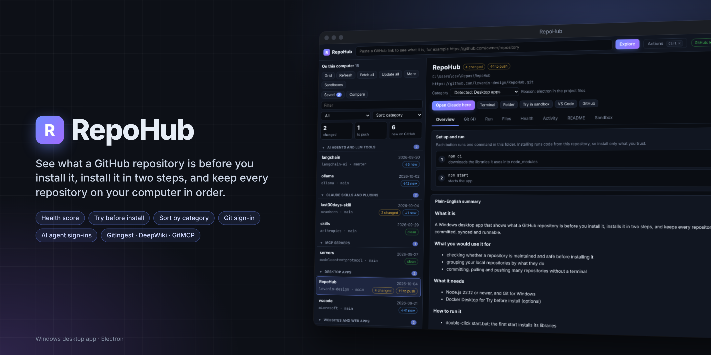

# RepoHub

**See what a GitHub repository is before you install it, install it in two steps, and keep every repository on this computer committed, synced and runnable.**

By Levani Sidiani. Windows desktop app (Electron). Runs from source on macOS and Linux.

---

## What it does

| Area | What you get |
| --- | --- |
| **Explore a link** | Paste any GitHub link (a deep link, an SSH address or `owner/repo` works too). RepoHub shows the description, stars, license, last change, languages and topics; what kind of project it is; which tools it needs, and whether they are installed on this computer; the settings it expects; the install steps; and cautions worth knowing (archived, no license, scripts that run during install, "pipe to shell" install lines). The README is shown in full. |
| **Health score** | A score out of 100 in six parts (activity, maintenance, people, documentation, engineering, safety), each showing the evidence behind its points, and a plain verdict on **Is this maintained?** with its reasons: recent changes and commits, releases, how fast issues close, whether one person wrote most of the code, automated checks, tests, license and security policy. |
| **Activity** | Commits per week for the last year, star history (signed in), releases over time, top contributors and languages, plus open issues, open pull requests and the last 90 days of issues and merges. Every chart has a hover tooltip and a table view. |
| **Files** | Browse the code before installing: the file tree on any branch, tag or commit, a file finder, syntax-highlighted files with line numbers, formatted Markdown, a link to any line (copied for sharing), Open on GitHub and Save a copy. Local repositories show your working copy, uncommitted changes included. |
| **Saved** | Save repositories with your own notes and tags, group them into collections, see what you viewed recently, and export to CSV or JSON. |
| **Compare** | Up to four repositories side by side: health score and its parts, maintenance verdict, stars, activity, releases, contributors, issue close time, license. The strongest value in each row is marked "▲ best". |
| **Git sign-in** | Settings → Accounts shows which GitHub accounts Git is signed in with (Git Credential Manager, part of Git for Windows) and signs you in or out. Sign-in opens Git Credential Manager's own browser window; RepoHub never sees your password. |
| **Connect RepoHub to GitHub** | Reuse a login you already have, either **your Git sign-in** or the **GitHub CLI** (`gh auth login`): 5,000 requests an hour instead of 60, star history and private repositories. The login stays in memory and is never written to disk. |
| **Explore with AI tools** | On a GitHub repository (a pasted link, or a local one with a GitHub address): **GitIngest** (the whole repository as one block of text for an AI chat), **GitDiagram** (an interactive architecture diagram), **DeepWiki** (wiki-style docs with a chat about the code) and **GitMCP** (a live link an AI coding assistant can use to look things up in the docs). Each opens in your browser or copies its link; GitMCP also has **Add to Claude Code**, which shows the exact command before running it. Public repositories only. |
| **AI agent sign-ins** | Settings → Accounts signs in to Claude, ChatGPT (Codex), Gemini, GitHub Copilot, Qwen Code, Kimi Code, Ollama, OpenCode, Kilo Code, Cline, Factory Droid and Mistral Vibe, each in its own window, with Install for any that are missing. DeepSeek, Perplexity and xAI (Grok) only offer API keys on Windows: RepoHub opens their key page and points to an agent that accepts the key. |
| **Plain-English summary** | **Explain with Claude** asks Claude Code on this computer to read the README and setup files and explain the repository: what it is, what you would use it for, what it needs, how to install and run it on Windows, and what to know first. Summaries are saved. |
| **Install** | Step 1 downloads the code (git clone) into your Repos folder; nothing runs. Step 2 shows the setup commands in order, each with its own Run button and its output in the app. |
| **Try before install (Live Demo)** | Runs the repository in a throwaway Docker container, with step-by-step progress, the log beside the running app, the run recipe (including the author's devcontainer.json when present), the isolation in plain words, and a time limit after which it removes itself. If it does not run, Claude can read the log and explain why. Also shows the running app in a separate preview window when you prefer. The container gets its own copy of the code and none of your folders, a cap of 2 GB memory, 2 CPUs and 1,024 processes, and ports reachable only from this computer. RepoHub detects how to install and start it (Node.js, Python, Streamlit, Gradio, static sites, or the repository's own Dockerfile); you can edit the commands first. If it fails, the log shows why before anything touches your system. **Shell** opens a terminal inside the container; **Remove** deletes it. |
| **Your repositories** | Every git repository under your user folder (or the folders you choose), with what needs attention: uncommitted changes, commits to push, new commits on GitHub, lock files, no GitHub address. |
| **Sort and group** | Sort the list by most recent, name (A to Z or Z to A), needs attention, or **category**: what each repository does (AI agents and LLM tools, Claude skills and plugins, MCP servers, desktop apps, websites and web apps, servers and APIs, command-line tools, libraries, data, video and media, documents and notes). RepoHub detects the category from the project files and shows why; choose another on the repository page and your choice is kept. Groups fold with a click. The grid sorts and groups the same way. |
| **Movable separators** | Drag the line between the list and the main area, or between the main area and pinned Settings. Arrow keys work when a separator has focus; double-click resets it. Widths are remembered. |
| **Git** | Fetch, Pull, Commit, Push and **Sync** (commit, then pull, then push). A rebase conflict is aborted and explained. Review the repository before resolving conflicts manually. Changed files open as a coloured diff. |
| **Run** | Buttons read from each repository's own files (npm scripts, pip, uv, docker compose), plus your own saved commands. Output streams into the app; Stop ends the command and everything it started. |
| **Claude** | **Open Claude here** opens a terminal window in the repository already running Claude Code. **Terminal** opens a plain one. |
| **Settings** | Searchable, and shown as a floating panel, pinned beside your work, or popped out into its own window. Appearance (day, night or follow Windows; five colour themes; text size; density; interface, reading and code fonts), writing style for Claude's explanations, start view and folders, accounts, installers, security (sandbox limits, time limit, strict mode, README images, confirm before installing, clear saved data), shortcuts and about. |
| **Installers** | One list of everything a repository may need: Git, Node.js and npm, pnpm, Yarn, Python, uv, Docker Desktop, Rust, Go, the GitHub CLI, VS Code, Windows Terminal, Claude Code, Codex, Gemini CLI and Copilot CLI. Shows what is installed, and installs the missing ones with the official installers (winget or npm) in a visible window after showing you the exact commands. |
| **Accounts** | Git identity, GitHub (through the GitHub CLI) and sign-in for Claude, ChatGPT (through Codex), Gemini and GitHub Copilot, each in its own window. |
| **Grid and Update all** | All repositories as cards with quick actions; **Update all** fetches visible repositories and fast-forwards only clean branches that are behind their upstream. Divergent histories, uncommitted work, missing remotes, locks and failed status checks get a clear reason. |
| **Command palette** | Ctrl+K: every action and repository, searchable, with its shortcut. |

## Requirements

| Needed for | Install |
| --- | --- |
| Running RepoHub from source | [Node.js](https://nodejs.org) 22.12 or newer (Node 24 LTS recommended) |
| Everything git | [Git for Windows](https://git-scm.com) (includes the GitHub sign-in helper) |
| Explain with Claude, Open Claude here | [Claude Code](https://docs.claude.com/en/docs/claude-code), signed in once |
| Try before install | [Docker Desktop](https://www.docker.com/products/docker-desktop/), running |
| More requests, star history, private repositories | [GitHub CLI](https://cli.github.com/), signed in once with `gh auth login` |
| Optional | VS Code (with "Add to PATH"), Windows Terminal |

## Start

- Double-click **start.bat** (the first run installs what RepoHub needs), or run `npm ci` then `npm start`
- Double-click **build-windows.bat** to build `release\RepoHub-Setup-1.5.0.exe` and a portable exe
- `npm run check` runs the engine checks (git actions on throwaway repositories, link parsing, file facts)

## Shortcuts

| Keys | Action |
| --- | --- |
| Ctrl+K | Command palette |
| Ctrl+, | Settings |
| Ctrl+L | Paste a link (focus the Explore box) |
| Ctrl+G | Repository grid |
| Ctrl+Shift+F / Ctrl+Shift+U | Fetch all / Update all |
| Ctrl+Shift+C / Ctrl+Shift+V | Copy selected log or code text / paste into the focused box |
| Right-click | In a log or code view: copies the selection |
| Drag a separator | Resize the list or pinned Settings; arrow keys when focused; double-click resets |
| F5 | Reload the window (page edits); running jobs and sandboxes keep running |
| Ctrl+Shift+R | Full relaunch (after editing main.js or preload.js) |
| F12 | DevTools |

## Versions

Each change is built in a new folder (RepoHub, RepoHub-v1.3.0, …), so the previous working version stays untouched. A new version folder reinstalls its libraries on first start (a minute or two). All versions share the same saved data and settings in %APPDATA%.

## Safety

- Previewing a link downloads nothing and runs nothing
- Downloading (clone) runs nothing; every setup command is shown and run only when you click it
- Reading status never writes into a repository, so it cannot leave a lock file behind
- The GitHub login RepoHub borrows (from Git or the GitHub CLI) is read when you connect or when RepoHub starts, held in memory only, and sent only to GitHub; Disconnect forgets it. It is read from Git with prompts turned off, so nothing pops up
- Category detection reads a few small project files and never follows a link that points outside the repository
- Git sign-in is handled by Git Credential Manager; RepoHub never sees or stores a password or token, and refuses remote addresses with one written into them
- Sandboxes share none of your folders and publish ports on 127.0.0.1 only; they do have internet access, because installing needs it. Only containers RepoHub created (named repohub-try-…) can be opened or removed from the app
- RepoHub never looks for programs in the current folder (this fixed git.js opening in Windows Script Host)
- Installers run only the fixed commands in installers.js, in a visible window, after showing them
- The Claude summary runs in an empty temporary folder with built-in tools disabled, an empty strict MCP configuration, and user/project settings disabled; repository content is supplied as data
- README content is sanitized and shown under a strict content policy; links open in your browser

## Limits

- Signed out, GitHub allows 60 requests an hour per network: about 20 previews, or 4 to 5 full Health checks (each about 13 requests). Sign in through the GitHub CLI for 5,000. Health and Activity results are kept for six hours. Private repositories cannot be previewed; download them instead (Git asks you to sign in), and RepoHub reads them from the folder
- Sandboxes run the version on GitHub, not your local changes, and cannot clone private repositories. Desktop (Electron) apps cannot show their window from a container. Projects that need several services (Docker Compose) run without the extra services
- Interactive commands (anything that asks questions) belong in **Terminal**, not the Output panel

## Checks in 1.6.0

- `npm run check`: 121 engine checks (18 new: the four AI tool links and what they refuse, the fixed GitMCP command, the agent catalog, sign-in and sign-out commands, uv installs, provider key pages)
- A real Electron window showed the four AI tools on a repository with a GitHub address and none on a local-only one, refused an arbitrary address, showed the GitMCP command before running it, and listed every agent and provider in Accounts
- Not yet verified on Windows: each agent's own sign-in, and Add to Claude Code with a real Claude Code install

## Checks in 1.5.0

- `npm run check`: 103 engine checks (21 new: category detection, your own category, link safety, sort and separator settings, Git sign-in status, reading the saved Git login with prompts off)
- `npm run check:regression`: 18 regression tests
- A real Electron window (Linux, isolated test data) found six test repositories, detected their categories, grouped and sorted them, saved a chosen category, saved the separator width, read the Git sign-in status, and kept the token out of the page
- Not yet verified on Windows: Git Credential Manager sign-in and sign-out with a real GitHub account, and connecting RepoHub through it
- The lockfile was refreshed so `npm ci` works on a clean machine (1.4.0's lockfile was missing some Windows packaging packages)

## Release verification (1.4.0)

See [AUDIT.md](AUDIT.md) for measured results, fixes, screenshots, blocked integrations and limitations.

- `npm run check`: engine integration checks using disposable repositories.
- `npm run check:regression`: safety and reliability regression tests.
- `npm run check:syntax`: JavaScript syntax validation. There is no TypeScript or ESLint configuration.
- `npm run check:desktop`: instruments a real source Electron window on local debug port 9333. Use isolated `REPOHUB_*` data paths under `audit/local/`; it refuses ordinary user settings.
- `npm run dist`: unsigned Windows x64 installer and portable executable. Windows may show publisher warnings.
- `node scripts/check/build-artifacts.js`: compare packaged runtime files with source and record executable SHA-256 checksums after building.

Sandbox limits are enforced by Docker. Sandboxes have internet access; there are no public demo URLs, network allowlists or browser-only execution. Normal app exit attempts to remove active containers. Full relaunch preserves them and restores saved deadlines. After a crash, expired containers are removed when RepoHub next starts with Docker available. Removal cannot be guaranteed while both the app and Docker are unavailable.

Supported devcontainer fields: `image`, string or argument-array `postCreateCommand`, and the first numeric `forwardPorts` entry. Features, Compose services, host mounts, custom users, remote environment, build contexts, other lifecycle hooks and arbitrary nested Dockerfile paths are not implemented. A root Dockerfile can be selected separately.

Agent account rows report installation, not authenticated sessions. Complete sign-in in the tool's own window. The npm Yarn installer installs Yarn Classic; modern Yarn projects need their documented Corepack setup.

The original package metadata declares MIT, but no license text was supplied with the local app. This audit does not add or invent a license grant.
